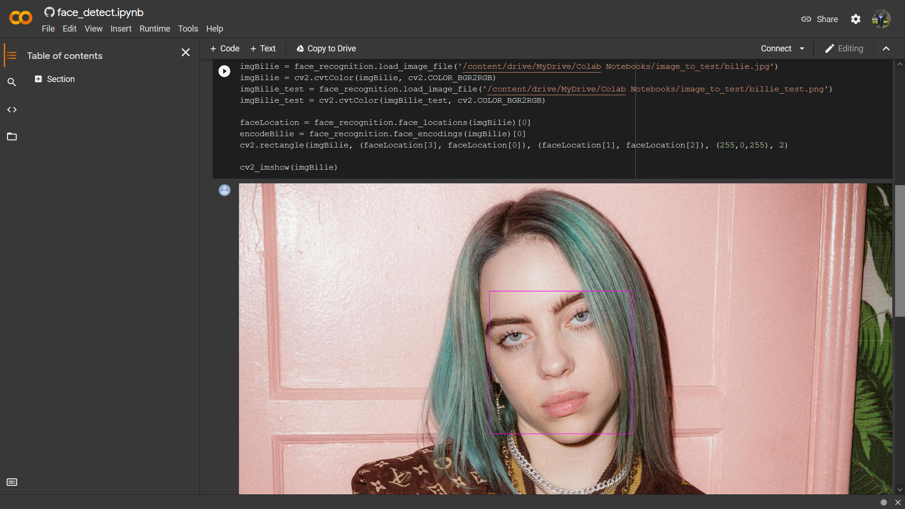
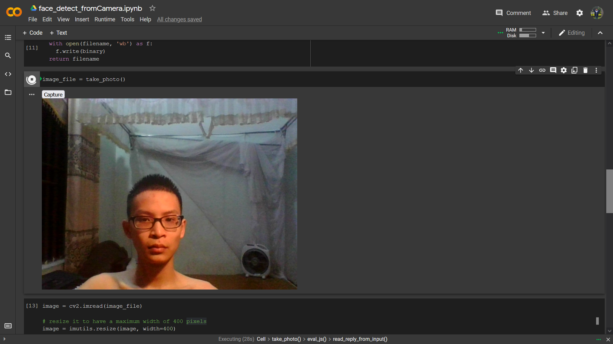
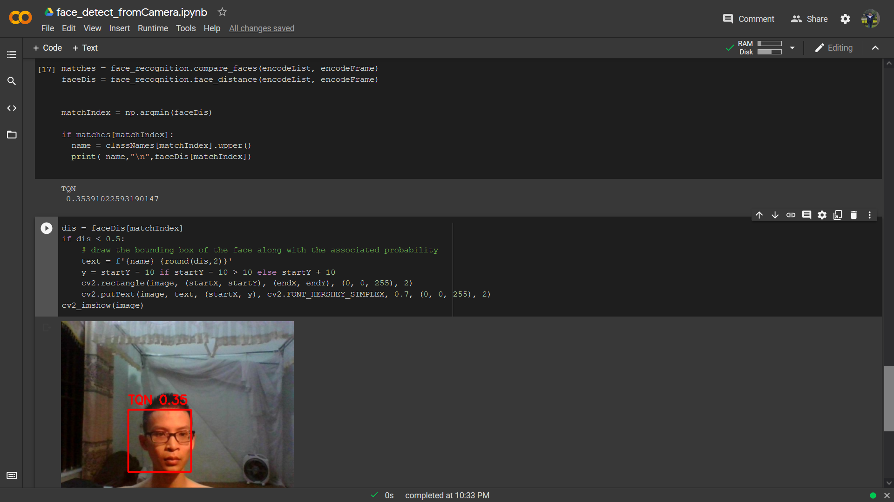

# Face recognition basic

## 1. Face detection

### 1.1. Install face-recognition packages

```
!pip install face_recognition
```

### 1.2 Using simple cv2, face-recognition to detect face in image



## 2. Face Recognition

### 2.1. Take a picture from your webcam

Using base code from Google Colab to open camera and take a picture



### 2.2. Show image and detect face


### 2.3. Recognize from image dataset image

First, encode input image and training image dataset, then compare and count distance. Choose min distance from the list and label for input image.


